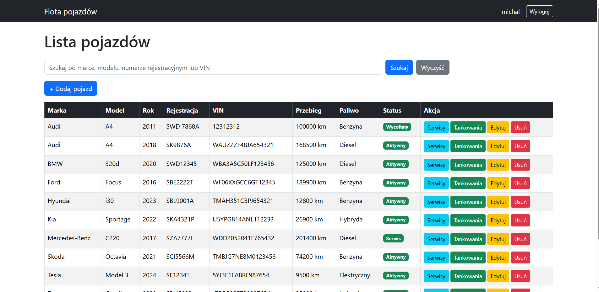

# 🚗 System Zarządzania Flotą Pojazdów

## Opis projektu

System Zarządzania Flotą Pojazdów to aplikacja internetowa stworzoną w języku PHP z wykorzystaniem frameworka Laravel. Projekt umożliwia zarządzanie flotą pojazdów, prowadzenie historii serwisowej oraz historii tankowań. Aplikacja wykorzystuje relacyjną bazę danych MySQL oraz architekturę MVC (Model-View-Controller).

Projekt został wykonany jako projekt zaliczeniowy przedmiotu



---

# Zastosowane technologie

Projekt został wykonany z wykorzystaniem następujących technologii:

- PHP 8.x
- Laravel
- MySQL
- Bootstrap 5
- Blade
- HTML5
- CSS3
- Composer
- Node.js
- npm
- XAMPP

---

# Funkcjonalności aplikacji

## Logowanie użytkowników

Aplikacja umożliwia logowanie użytkowników do systemu.

Dostępne funkcje:

- logowanie do systemu,
- wylogowanie,
- autoryzacja użytkowników,
- system ról (Administrator oraz Użytkownik).

Rejestracja użytkowników została wyłączona. Konta tworzone są bezpośrednio przez administratora w bazie danych.

---

## Zarządzanie pojazdami

Administrator może:

- dodawać pojazdy,
- edytować dane pojazdu,
- usuwać pojazdy.

Dla każdego pojazdu przechowywane są informacje:

- marka,
- model,
- rok produkcji,
- numer rejestracyjny,
- numer VIN,
- przebieg,
- rodzaj paliwa,
- status pojazdu.

---

## Wyszukiwanie pojazdów

System umożliwia wyszukiwanie pojazdów według:

- marki,
- modelu,
- numeru rejestracyjnego,
- numeru VIN.

---

## Historia serwisowa

Każdy pojazd posiada własną historię serwisową.

Administrator może dodawać oraz usuwać wpisy serwisowe.

Każdy wpis zawiera:

- datę serwisu,
- typ serwisu,
- opis wykonanych prac,
- koszt,
- przebieg pojazdu.

---

## Historia tankowań

System umożliwia prowadzenie historii tankowań.

Każde tankowanie zawiera:

- datę tankowania,
- ilość zatankowanego paliwa,
- cenę za litr,
- przebieg pojazdu.

Aplikacja automatycznie oblicza koszt tankowania.

Jeżeli podczas dodawania tankowania podany zostanie większy przebieg niż aktualny przebieg pojazdu, aplikacja automatycznie aktualizuje przebieg pojazdu.

---

## Walidacja formularzy

Podczas dodawania oraz edycji pojazdu sprawdzane są między innymi:

- wymagane pola,
- poprawność roku produkcji,
- poprawność przebiegu,
- długość numeru VIN,
- unikalność numeru VIN,
- unikalność numeru rejestracyjnego.

---

## Role użytkowników

### Administrator

Administrator posiada pełny dostęp do systemu.

Może:

- dodawać pojazdy,
- edytować pojazdy,
- usuwać pojazdy,
- dodawać historię serwisową,
- usuwać wpisy serwisowe,
- dodawać tankowania,
- usuwać tankowania.

### Użytkownik

Użytkownik może:

- przeglądać listę pojazdów,
- przeglądać historię serwisową,
- przeglądać historię tankowań.

Nie posiada uprawnień do modyfikacji danych.

---

# Struktura bazy danych

Projekt wykorzystuje relacyjną bazę danych MySQL.

Najważniejsze tabele:

## users

Przechowuje użytkowników systemu.

Pola:

- id
- name
- email
- password
- role

---

## vehicles

Przechowuje informacje o pojazdach.

Pola:

- brand
- model
- year
- registration_number
- vin
- mileage
- fuel_type
- status

---

## services

Przechowuje historię serwisową.

Pola:

- vehicle_id
- service_date
- type
- description
- cost
- mileage

---

## fuel_logs

Przechowuje historię tankowań.

Pola:

- vehicle_id
- fuel_date
- liters
- price_per_liter
- mileage

---

# Relacje pomiędzy tabelami

- Jeden pojazd może posiadać wiele wpisów serwisowych.
- Jeden pojazd może posiadać wiele tankowań.
- Historia serwisowa oraz historia tankowań są powiązane z konkretnym pojazdem.

---

# Architektura projektu

Projekt został wykonany zgodnie z architekturą MVC.

### Modele

- User
- Vehicle
- Service
- FuelLog

### Kontrolery

- VehicleController
- ServiceController
- FuelLogController
- ProfileController

### Widoki

Widoki zostały wykonane z wykorzystaniem silnika szablonów Blade oraz frameworka Bootstrap.

---

# Wymagania

Do uruchomienia projektu wymagane są:

- PHP 8.x
- Composer
- Node.js
- npm
- XAMPP
- MySQL

Projekt został wykonany oraz przetestowany przy użyciu środowiska **XAMPP**.

---

# Instalacja projektu

## 1. Pobranie projektu

Pobrać projekt z repozytorium Git lub jako archiwum ZIP.

```bash
git clone https://github.com/mormych/flota-pojazdow
```

---

## 2. Przejście do katalogu projektu

```bash
cd flota-pojazdow
```

---

## 3. Instalacja zależności PHP

```bash
composer install
```

---

## 4. Instalacja zależności JavaScript

```bash
npm install
```

---

## 5. Budowanie zasobów

```bash
npm run build
```

---

## 6. Konfiguracja środowiska

Skopiuj plik:

```
.env.example
```

do pliku:

```
.env
```

Następnie skonfiguruj połączenie z bazą danych:

```
DB_CONNECTION=mysql
DB_HOST=127.0.0.1
DB_PORT=3306
DB_DATABASE=flota_pojazdow
DB_USERNAME=root
DB_PASSWORD=
```

---

## 7. Uruchomienie XAMPP

Uruchom **XAMPP Control Panel**.

Włącz usługi:

- Apache
- MySQL

Następnie otwórz:

```
http://localhost/phpmyadmin
```

i utwórz bazę danych:

```
flota_pojazdow
```

---

## 8. Wygenerowanie klucza aplikacji

```bash
php artisan key:generate
```

---

## 9. Wykonanie migracji

```bash
php artisan migrate
```

---

## 10. Uruchomienie aplikacji

```bash
php artisan serve
```

Aplikacja będzie dostępna pod adresem:

```
http://127.0.0.1:8000
```

Przed uruchomieniem aplikacji należy upewnić się, że w XAMPP uruchomione są usługi **Apache** oraz **MySQL**.

---

# Opis działania aplikacji

1. Administrator loguje się do systemu.
2. Administrator dodaje pojazdy do floty.
3. Dla każdego pojazdu może prowadzić historię serwisową.
4. Dla każdego pojazdu może prowadzić historię tankowań.
5. System automatycznie wylicza koszt tankowania.
6. Użytkownicy mogą przeglądać dane pojazdów oraz ich historię.

---

# Przykładowe dane

Projekt umożliwia dodanie dowolnej liczby pojazdów.

Przykładowe dane:

- BMW 320d
- Audi A4
- Volkswagen Passat
- Toyota Corolla
- Skoda Octavia

Każdy pojazd może posiadać własną historię serwisową oraz historię tankowań.

---

# Autor

Michał Adamiak. Projekt wykonany jako projekt zaliczeniowy przedmiotu.